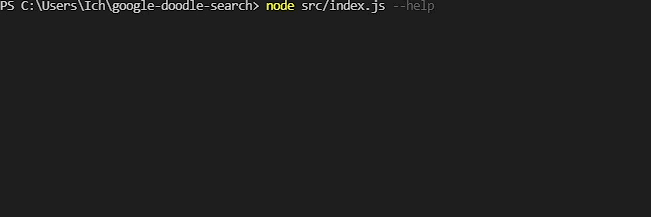

# Google Doodle Search
Command Line Tool to search Goodle Doodles for keywords and write to a CSV file

**Unfortunately the Google Doodle Website got completly reworked and now uses reCaptcha. Therefore this script doesn't work anymore.  
But the new Search does cover the functionality of this script completely: [Google Doodle Search](https://doodles.google/search/)**

**To get notified about new specific doodles check my other updated project: [Google Doodle Notification](https://github.com/TalkLounge/google-doodle-notification)**

## Table of Contents
- [Google Doodle Search](#google-doodle-search)
  - [Table of Contents](#table-of-contents)
  - [Installation](#installation)
    - [1. Requirements](#1-requirements)
    - [2. Download](#2-download)
  - [Usage](#usage)
    - [Example](#example)
    - [Demo](#demo)
  - [Disclaimer](#disclaimer)
  - [License](#license)

## Installation
### 1. Requirements
* [Node.js](https://nodejs.org/en/)

### 2. Download
```
git clone https://github.com/TalkLounge/google-doodle-search
cd google-doodle-search
npm install
```

## Usage
### Example
```
node src/index.js --type interactive --desc game
```
### Demo


## Disclaimer
Use on your own risk.
Google may prohibit the scraping

## License
MIT
